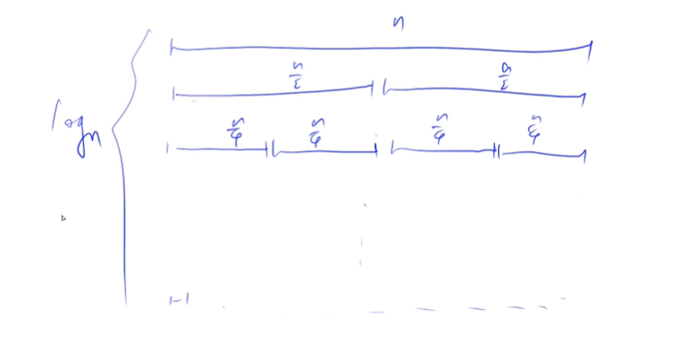

# 归并排序

- ### 题号：

  - a[acwing787](https://www.acwing.com/activity/content/problem/content/821/)

- ### 解题思想：

  - 基于分治的思想。以数组的中心点为分（区别于快排），分为左边和右边，分别递归排序，最后合并起来。

- ### 解题步骤：

  1. 确定分界点 mid。
  2. 递归排序左边和右边
  3. 归并，把两个有序的序列（左边和右边）合二为一。（难点）

- ### 解析：

  - 第 1 步的解析：
    1. 分界点 mid 就是中间点（这个中间点是指数组下标的中间值），也就是真正的中间点。区别于快排，快排是找一个点，把他的值做分界的值，分为左边和右边，但这个点不一定在分界点上，只是他的值等于分界点的值。
    1. 注意 x[i++]=y[j++]这种写法；x[i++]=y[i++]是错的，不能这么写，会错位
  - 稳定：归并排序是稳定的，快速排序是不稳定的。稳不稳定的定义是，一个已经排序过得数组，再通过排序方法排序，会不会改变他的顺序。

  - 时间复杂度：

    O(nlogn)

    分析：

    

    第一层需要处理 n 次，第二层处理 2 个 n/2 次，第三层处理 4 个 n/4 次...第 n 层处理 n 个 1 次

    n 除以多少次 2 等于 1 呢，是 logn 次

    所以归并排序有 logn 层，每层处理 n 次

    所以是 O(nlogn)
