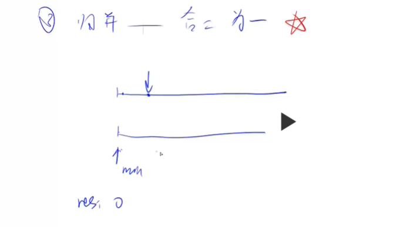
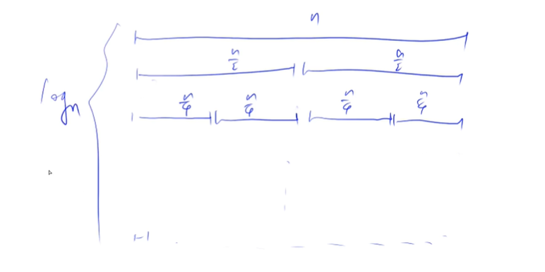

# 归并排序

- ### 题号：

  - [acwing788](https://www.acwing.com/activity/content/problem/content/822/)

- ### 解题思想：
  - 逆序对：从左往右，从一组数中先后选出两个数，第一个数比第二个数大，则这俩构成一个逆序对
  - 基于分治的思想。以数组的中心点为分（区别于快排），分为左边和右边，分别递归排序，最后合并起来。

- ### 解题步骤：

  1. 确定分界点 mid。
  2. 递归排序左边和右边
  3. 归并，把两个有序的序列（左边和右边）合二为一。（难点）

- ### 解析：

  - 第三步的解析：
    使用一个同向的双指针算法：因为是合并两个有序的数组，所以只要双指针顺序循环，哪一个序列的值大，就把哪一个值填入 res 中，哪一个序列先全部填完，就把另一个序列剩下的值按顺序填入即可

    如图：
    

  1. 分界点 mid 就是中间点（这个中间点是指数组下标的中间值），也就是真正的中间点。区别于快排，快排是找一个点，把他的值做分界的值，分为左边和右边，但这个点不一定在分界点上，只是他的值等于分界点的值。
  2. 注意 x[i++]=y[j++]这种写法；x[i++]=y[i++]是错的，不能这么写，因为i加了两次

  ```js
  let x = [],
    y = [4, 5, 6];

  let i = 0;
  while (i < 3) {
    x[i++] = y[i++];
  }
  console.log(x, y); //[ 5, <1 empty item>, undefined ] [ 4, 5, 6 ]

  let x = [],
    y = [4, 5, 6];

  for (let i = 0; i < 3; i++) {
    x[i] = y[i];
  }
  console.log(x, y); // [ 4, 5, 6 ] [ 4, 5, 6 ]
  ```

  - 稳定：归并排序是稳定的，快速排序是不稳定的。稳不稳定的定义是，一个已经排序过得数组，再通过排序方法排序，会不会改变他的顺序。

  - 时间复杂度：

    O(nlogn)

    分析：

    

    第一层需要处理 n 次，第二层处理 2 个 n/2 次，第三层处理 4 个 n/4 次...第 n 层处理 n 个 1 次

    n 除以多少次 2 等于 1 呢，是 logn 次

    所以归并排序有 logn 层，每层处理 n 次

    所以是 O(nlogn)
