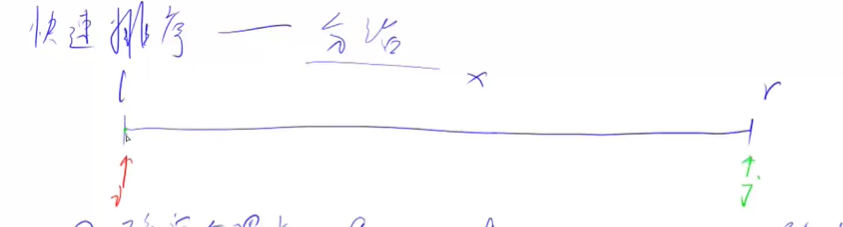

# 快排

- ### 题目：

  - [acwing785](https://www.acwing.com/activity/content/problem/content/819/)

- ### 解题思想：

  - 基于分治的思想，找到一个分界点，使得左边的值小于分界点的值，右边的值大于分界点的值，然后递归处理左右两段。

- ### 解题步骤：

  1. 确定分界点，可以取任意点，这里我们取中点，分界点的值为 x, x=q[l+r>>1]
  2. 调整区间,使得界限左边的数都小于等于 x,右边的数都大于等于 x（调整后，分界点就不一定是中点，他是在左边和右边连接处的位置） （难点）
  3. 递归处理左右两段

- ### 解析：

  - 第 2 步有两种常见的处理：

    1. 是暴力解法，多占用空间，int a[],b[], 扫描 q[],如果小于等于 x 的放入 a,大于 x 的放入 b，最后再把 a,b 中的数拼起来赋值给 q ，a 与 b 相连的地方就是界限
    2. 是相向的双指针，i 和 j，因为边界问题，所以从两边开始取，如果 q[i]<x，指针就右移，如果 q[i]>=x 则停下，同理 q[j]，如果 q[j]大于 x 则指针左移，否则停下。此时交换 q[i]和 q[j]，i 右移 1 格，j 左移 1 格，直至 i 和 j 相遇，相遇的地方就是界限，界限左边都<=x,右边都>=x。

    如图
     3. 时间复杂度 O(nlog(n))

  - 稳定：快速排序是不稳定的。稳不稳定的定义是，一个已经排序过得数组，再通过排序方法排序，会不会改变他的顺序。

  - 时间复杂度分析：
    

    参考归并排序的图

    虽然每次划分的区间，不一定是 n/2 的，但是期望是 n/2，

    在这个情况下，最后划分的层数也就是递归的次数的期望就会使 logn 的（可以数学证明）

    故时间复杂度是 O(nlogn)
